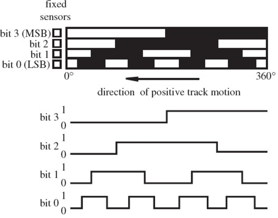
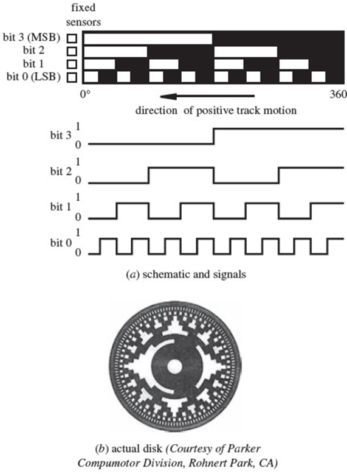

#MTRN/2060  #Circuits #Logic 
[amt10_v-1775837](Attachments/amt10_v-1775837.pdf)
[EE-SX1042](Attachments/EE-SX1042.pdf)
[HLMP  LED Datasheet](Attachments/HLMP%20%20LED%20Datasheet.pdf)

# Simple Electromechanical Sensors:
•Proximity sensors and switches
•Potentiometers
•Linear Variable differential transformers
•Optical encoders
•Strain gages
•Load cells
•Accelerometers
•Gyroscopes
•Pressure and flow sensors…

# Switch Bounce
http://video_demos.colostate.edu/mechatronics/switch_bounce.wmv
#Video
Switches always have the potential to bounce. Your CPU may check the state of the switch many times during the bounce. Circuits and code an accommodate this preventing a single switch throw from being read as a bunch of switches.

# Gray Code:

# Binary Code:

# Accelerometer and Gyroscope:
•Modern ones are tiny vibrating pieces of silicon or other crystal.

•Accelerometer measures change in speed. Accelerometers also measure gravity.

•Ideally a gyro measures absolute tilt. Vibrating gyros really measure changes in tilt. To get absolute tilt you need to integrate the small changes.

•Typically drones and some cell phones have both and use data from both to quickly determine absolute tilt in noisy environments like a vibrating helicopter.

**Temperature Measurement**:
•Bimetallic Strip: two strips of metal with different thermal expansion coefficients. Bend when heated.

•RTD (Resistance Temperature Device): Typically a platinum wire. It gets more resistive with temperature. Can operate over -220C to 750C!

•Thermistor: Semiconductor device whose resistance decreases exponentially with temperature. Highly accurate (0.01C) over a narrow T range.

•Thermocouple: produces a voltage proportional to the difference in temperature between to dissimilar metal junctions. Easy to use with long lead wires, typically +/- 1C accuracy.

•Thermopile: a bunch of thermocouples in series to increase the voltage

•Semiconductors: Uses the temperature dependent gain of a BJT (what we have for the lab). ESD sensitive, not easy to make good thermal contact. Cheap.

# Light Measurement
•Phototransistors: silicon solar cell acts as the base in a BJT. Infrared remote controls. cheapish, large dynamic range. Sensitive in near infrared (900 nm), fast (5 us)

•Photodiode: Same as Photovoltaics. Light generates a small amount of current. If small, then need a measurement circuit.

•Photoresistor: A high resistance semiconductor. CdS resistor gets less resistive when illuminated. Sensitive in the visible range (green), cheap, slow (20 ms)

•CMOS detector: An array of photodiodes. In most cell phone cameras. Can be integrated into normal silicon process,

•CCD detector: Usually higher sensitivity than CMOS, made on separate chips.

•Color detection can be done using colored glass or interference filters over semiconductor detectors like photodiodes.

# Practice Quiz Questions
This sensor typically has 4 wires, often marked 5V, GND, A, B. What type of sensor is it likely to be?

**a. Relative encoder

b. Turnpot

c. Hall effect sensor

d. photoemitter-detector pair

e. Absolute encoder

f. Linear Variable differential transformer

What is a typical amount of time for switch bounce to settle?

Select one:

a. 500 ms

**b. 500 us**

c. 500 ns

